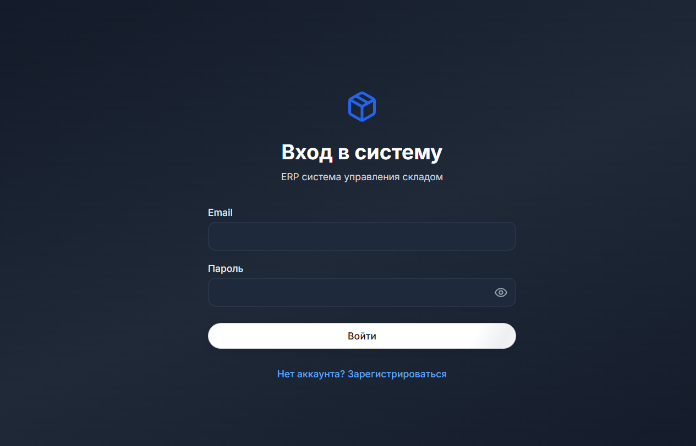
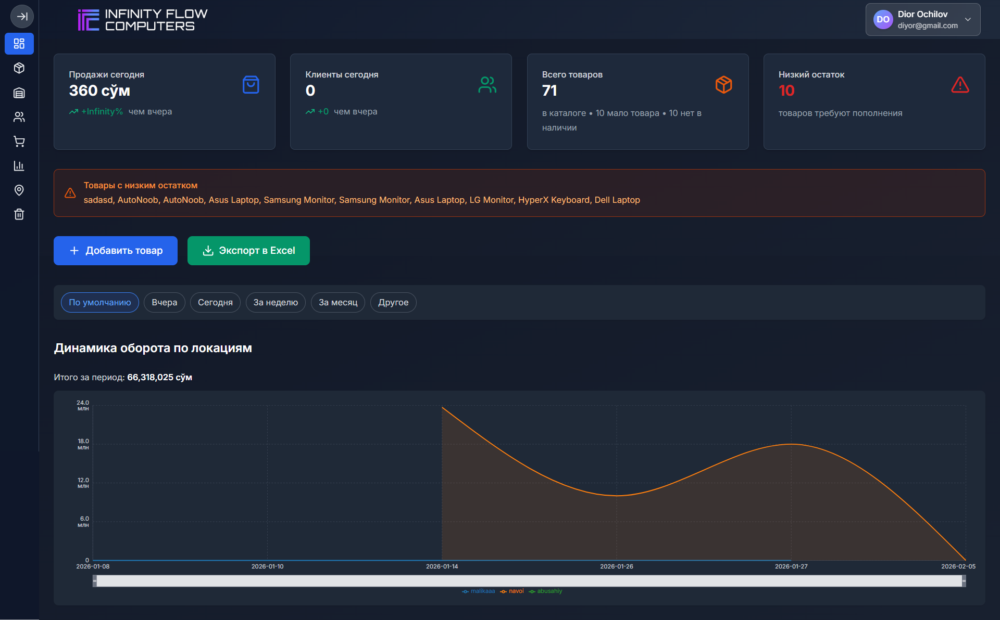
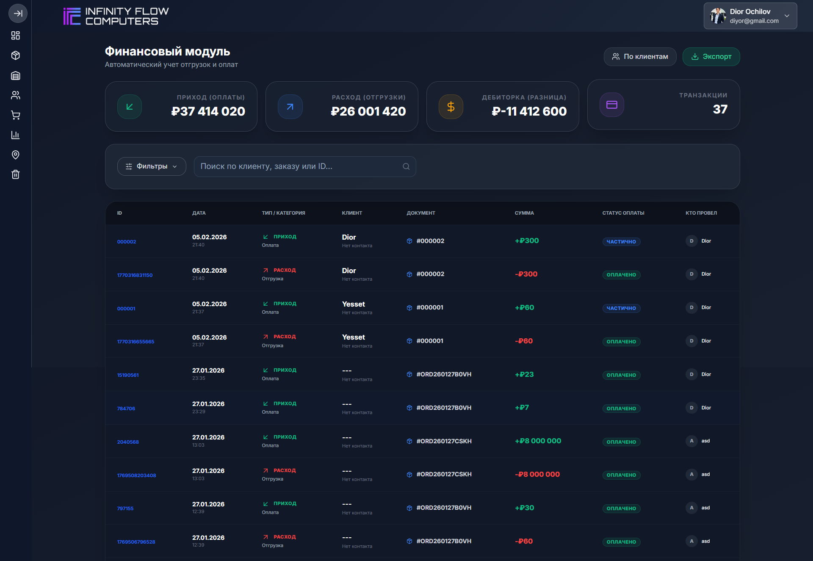
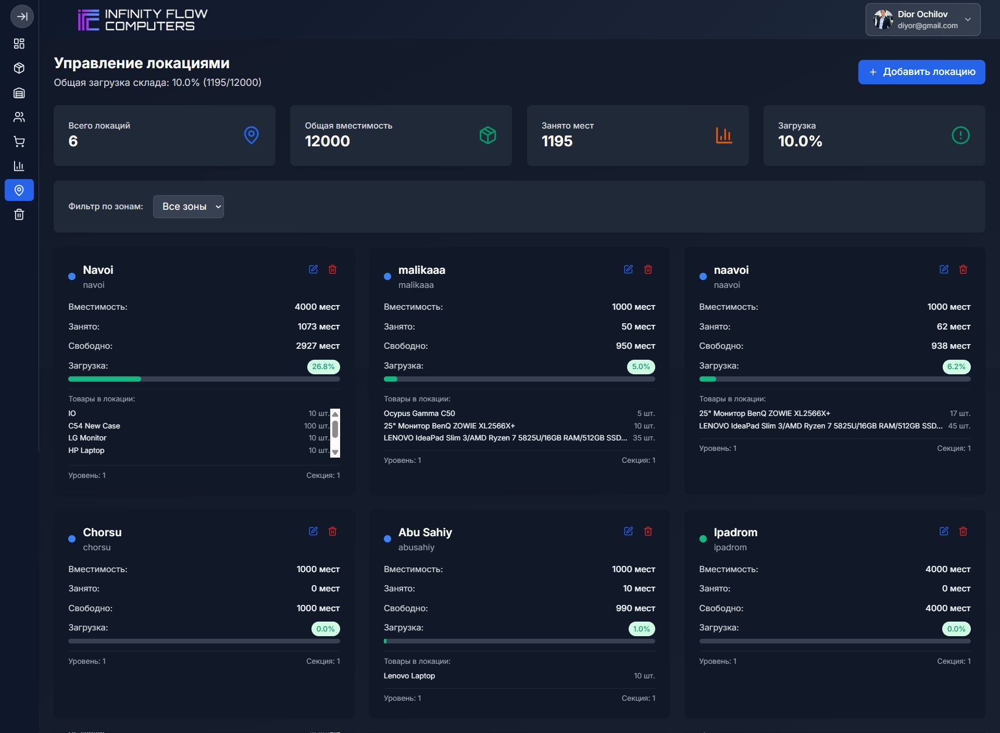
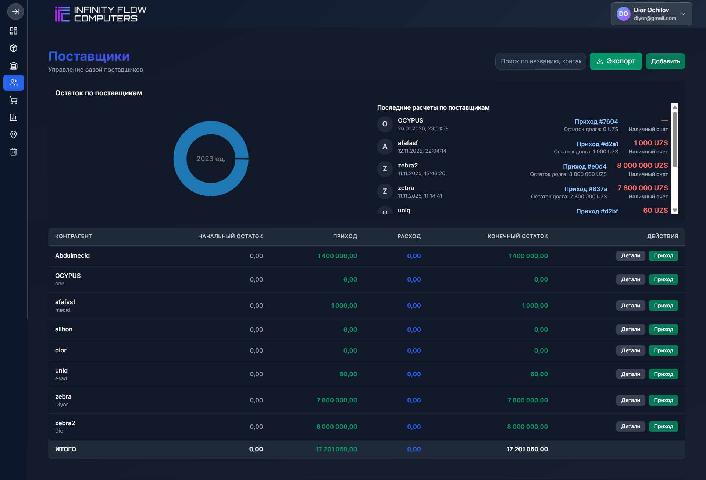
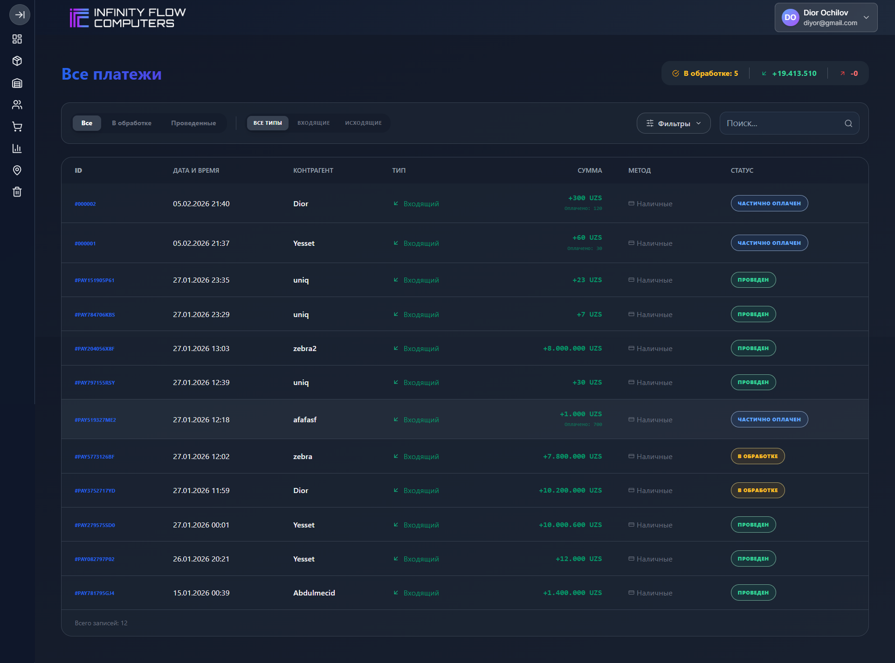

#  Depo ERP Yönetim Sistemi

Modern web teknolojileri kullanılarak geliştirilmiş, **stok, satış, finans ve kullanıcı yönetimini** tek panelden sağlayan kapsamlı bir **Depo ERP Yönetim Sistemi**.

Bu proje, küçük ve orta ölçekli işletmelerin depo süreçlerini dijitalleştirmek ve verimli hale getirmek amacıyla geliştirilmiştir.

---

##  Proje Özeti

Bu sistem sayesinde kullanıcılar:

- Ürün ve stok takibi yapabilir
- Giriş / çıkış işlemlerini yönetebilir
- Satış ve sipariş kayıtlarını tutabilir
- Cari hesapları görüntüleyebilir
- Finansal raporlar oluşturabilir
- Kullanıcı yetkilendirmesi yapabilir
- Mail bildirimleri alabilir

Tüm işlemler web tabanlı, güvenli ve gerçek zamanlı olarak gerçekleştirilmektedir.

---

##  Kullanılan Teknolojiler

| Katman | Teknoloji |
|--------|-----------|
| Frontend | React.js, TypeScript, Vite |
| Backend | Node.js, Express.js |
| Veritabanı | MongoDB (MongoDB Atlas) |
| Stil | Tailwind CSS |
| Kimlik Doğrulama | JWT (JSON Web Token) |
| Dosya Yükleme | Cloudinary |
| Mail Servisi | Nodemailer (Gmail SMTP) |
| Güvenlik | Helmet, Rate Limiter |
| Deploy | Render Cloud Platform |

---

##  Sistem Mimarisi

```text
Kullanıcı (Browser)
        ↓
   React Frontend
        ↓
   REST API (Express)
        ↓
    MongoDB Atlas
```
##  Proje Yapısı
📦 depo-erp-system
 ┣ 📂 src              → Frontend kaynak kodları
 ┣ 📂 routes           → API endpointleri
 ┣ 📂 models           → MongoDB şemaları
 ┣ 📂 controllers      → İş mantığı
 ┣ 📂 middleware       → Auth & güvenlik
 ┣ 📂 uploads          → Yüklenen dosyalar
 ┣ 📂 dist             → Build çıktısı
 ┣ 📜 server.js        → Backend ana dosya
 ┣ 📜 package.json     → Bağımlılıklar
 ┗ 📜 .env             → Ortam değişkenleri

 
##  🔐 Kimlik Doğrulama Sistemi

Sistemde JWT tabanlı authentication kullanılmıştır.

Özellikler:

Güvenli token üretimi

Oturum yönetimi

Rol bazlı erişim

Otomatik token süresi

## 🔐 Sistem Özellikleri ve Modüller

Aşağıdaki tabloda projede kullanılan tüm sistem bileşenleri ve işlevleri özetlenmiştir:

| Kategori | Bileşen / Modül | Kullanılan Teknoloji | Açıklama |
|----------|----------------|----------------------|----------|
| Kimlik Doğrulama | Kullanıcı Giriş / Kayıt | JWT, Express Auth | Güvenli oturum yönetimi ve token sistemi |
| Kimlik Doğrulama | Yetkilendirme | Middleware | Rol bazlı erişim kontrolü |
| Kullanıcı Yönetimi | Kullanıcı Paneli | React, MongoDB | Kullanıcı oluşturma ve düzenleme |
| Ürün Yönetimi | Ürün Modülü | Express, Mongoose | Ürün ekleme, silme, güncelleme |
| Stok Takibi | Stok Hareketleri | MongoDB | Giriş / çıkış işlemleri |
| Satış Yönetimi | Sipariş Sistemi | REST API | Satış ve sipariş kayıtları |
| Finans | Borç / Alacak | MongoDB | Cari hesap takibi |
| Tedarikçi | Firma Yönetimi | Express API | Tedarikçi bilgileri |
| Depo Yönetimi | Envanter Sayımı | Backend Services | Depo kontrol sistemi |
| Raporlama | Excel / Grafik | Custom Utils | Finans ve stok raporları |
| Dosya Yönetimi | Görsel Yükleme | Cloudinary | Ürün görselleri |
| Mail Sistemi | Bildirimler | Nodemailer | Şifre sıfırlama ve bilgilendirme |
| Güvenlik | Rate Limiting | Express Rate Limit | DDOS ve spam koruması |
| Güvenlik | HTTP Headers | Helmet | Güvenlik başlıkları |
| Güvenlik | CORS Kontrolü | CORS Middleware | Domain erişim kontrolü |
| Veritabanı | Veri Depolama | MongoDB Atlas | Bulut tabanlı veritabanı |
| Performans | Sıkıştırma | Compression | Veri aktarım optimizasyonu |
| Deploy | Sunucu Yayını | Render | Canlı ortam yönetimi |
| Frontend | Kullanıcı Arayüzü | React, TypeScript | Modern SPA yapı |
| Stil | UI Tasarım | Tailwind CSS | Responsive tasarım |

## 🗄️ Veritabanı Yapısı

Proje MongoDB NoSQL veritabanı kullanmaktadır. Temel koleksiyon yapısı aşağıdaki gibidir:

| Koleksiyon | Alanlar | Teknoloji | Açıklama |
|------------|---------|-----------|----------|
| users | name, email, password, role | MongoDB, Mongoose | Kullanıcı bilgileri |
| products | name, code, price, stock | MongoDB | Ürün kayıtları |
| orders | userId, products, total | MongoDB | Sipariş verileri |
| stocks | productId, quantity, type | MongoDB | Stok hareketleri |
| payments | orderId, amount, status | MongoDB | Ödeme işlemleri |
| suppliers | company, contact, address | MongoDB | Tedarikçi bilgileri |
| finance | debit, credit, balance | MongoDB | Finans kayıtları |
| shifts | userId, start, end | MongoDB | Vardiya takibi |
| shipments | trackingNo, status | MongoDB | Kargo bilgileri |
| inventory | productId, count | MongoDB | Envanter sayımı |

## 📷 Arayüz Görselleri

Aşağıda sistemin temel ekranlarına ait örnek görseller yer almaktadır:

| Ekran | Açıklama | Önizleme |
|-------|----------|----------|
| Giriş | Kullanıcı Login Paneli |  |
| Dashboard | Yönetim Paneli |  |
| Finace | Finans Paneli |  |
| Location | Lokasyon Paneli |  |
| Supplier | Tedarikçi Paneli |  |
| Payments | Ödemeler Paneli |  |

## 🔒 Güvenlik Özellikleri

Projede uygulanan güvenlik önlemleri aşağıda listelenmiştir:

| Katman | Yöntem | Teknoloji | Amaç |
|--------|--------|-----------|-------|
| Kimlik | JWT Token | jsonwebtoken | Güvenli oturum |
| Şifreleme | Password Hash | bcrypt | Şifre güvenliği |
| Ağ | CORS | cors | Yetkisiz erişim |
| HTTP | Header Koruma | helmet | XSS koruması |
| Trafik | Rate Limit | express-rate-limit | DDOS önleme |
| Veri | Validation | Mongoose | Veri doğrulama |
| Sunucu | HTTPS | Render SSL | Güvenli bağlantı |

## 📈 Geliştirilebilir Özellikler

Proje ilerleyen süreçlerde aşağıdaki özelliklerle geliştirilebilir:

| Alan | Özellik | Açıklama | Durum |
|------|----------|----------|-------|
| Mobil | Mobil Uygulama | Android / iOS desteği | Planlanıyor |
| Dil | Çoklu Dil | TR / EN / RU desteği | Planlanıyor |
| Rapor | Dashboard | Gelişmiş grafikler | Planlanıyor |
| AI | Stok Tahmini | Yapay zeka analizi | Planlanıyor |
| Yetki | Rol Sistemi | Gelişmiş izinler | Planlanıyor |
| ERP | Entegrasyon | Muhasebe sistemleri | Planlanıyor |
| Bildirim | Push System | Anlık bildirimler | Planlanıyor |

## 👨‍💻 Geliştirici

| Alan | Bilgi |
|------|-------|
| Ad Soyad | Abdulmecid Nasir |
| Meslek | Bilgisayar Mühendisi |
| Uzmanlık | Full Stack Developer |
| Email | yusuf.mecid2002@gmail.com|
| GitHub | https://github.com/AbdulmecidNasir |
| LinkedIn | https://www.linkedin.com/in/abdulmecid-nasir-546457294/|
| Konum | Türkiye |
